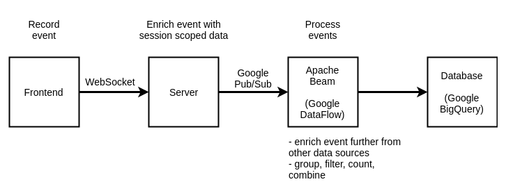

Trying to figure out how to implement user events on the frontend. Like, which events make sense, what's the event's structure and how to handle sending them to the server. I also wanted to try out Apache Beam.

I've had this topic on my mind, but I had just to try some stuff out after seeing this paper mentioned in a talk I watched: [The Unified Logging Infrastructure for Data Analytics at Twitter](http://vldb.org/pvldb/vol5/p1771_georgelee_vldb2012.pdf).

### The following tables are from the above mentioned paper.

## Event name
### client:page:section:component:element:action
| Component | Description                       | Example                                        
|-----------|-----------------------------------|------------------------------------------------
| client    | client application                | web, iphone, android                           
| page      | page or functional grouping       | home, profile, who to follow                   
| section   | tab or stream on a page           | home, mentions, retweets, searches, suggestions
| component | component, object, or objects     | search box, tweet                              
| element   | UI element within the component   | button, avatar                                 
| action    | actual user or application action | impression, click, hover                        

## The actual event object
| Field           | Description                    
|-----------------|--------------------------------
| event initiator | {client, server} × {user, app} 
| event name      | event name                     
| user id         | user id                        
| session id      | session id                     
| ip user’s       | IP address                     
| timestamp       | timestamp                      
| event details   | event details                  

### Sample event from the app
```json
{
  "eventName": "frontend:home:button:click",
  "view": "home",
  "dataTestid": "do-a-thing-button",
  "userId": "12345",
  "eventInitiator": "frontend:user",
  "timestamp": "2019-07-01T04:22:22.052Z",
  "ip": "192.168.64.1"
}
```

Basically:

1. User clicks a button, submits a form, navigates to another view, as generic examples
2. Send event to the server via web socket
3. Receive event on the server and enrich it with more data from session/headers (ip address, flags/version if canary)
4. Forward event to the next step in the data pipeline

The processing pipeline implemented in the code is just reading from a log file every minute and processing the data with Apache Beam. Really, the point of this is to try things out so how the data gets there and when it's processed isn't very important in this context.

I did however try to get stream processing to work with Google PubSub, but from what I read PubSub doesn't currently work with the direct Beam runner (local machine) in the Go Beam SDK. I would've had to set up a distributed data processing system like Apache Spark or Flink to make it work.

### Ideally:


### Google Pub/Sub + Dataflow + BigQuery would probably be a great option that's easy to manage
