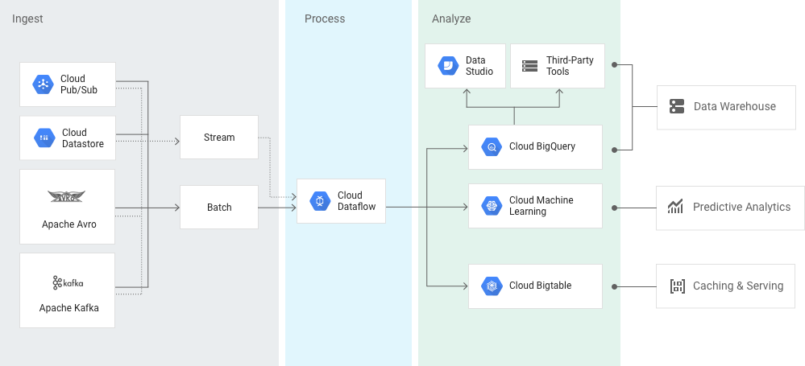

Trying to figure out how to implement user events on the frontend. Like, which events make sense, what's the event's structure and how to handle sending them to the server.

I've had this topic on my mind, but I had just to try some stuff out after seeing this paper mentioned in a talk I watched: [The Unified Logging Infrastructure for Data Analytics at Twitter](http://vldb.org/pvldb/vol5/p1771_georgelee_vldb2012.pdf).

Basically:

1. User clicks a button, submits a form, navigates to another view, as generic examples
2. Send event to the server via web socket
3. Receive event on the server and enrich it with request/socket specific data (ip address at the very least)
4. Forward event to the next step in the data pipeline

The implemented pipeline is just reading from a log file every 5 minutes and processing the data with Apache Beam.

I tried to get stream processing to work with Google PubSub using the Go Beam SDK, but from what I read it only works using an actual distributed Beam runner (on Spark, Flink, Apex etc.)

### ideally:
- server listens for events from the frontend
- send events to pubsub
- consume the events with Beam
- aggregate into stats
- save to database

```
Frontend
  |
  | websockets
  |
Server
  |
  | temporary store or queue (batch=store, stream=queue)
  |
Beam
  |
  |
  |
Database
```

### Google Pub/Sub + Dataflow + BigQuery would probably be a great option that's easy to manage


# TODO: save processed data LOL
